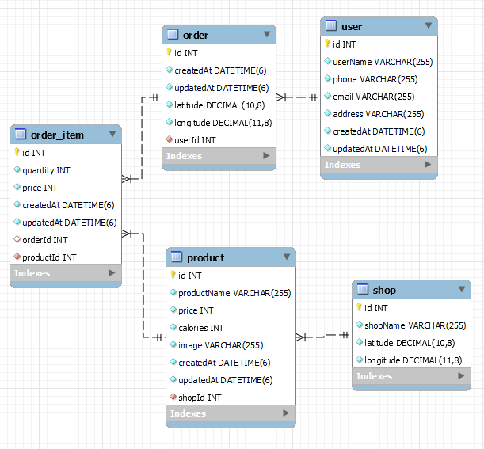

1. To run the app, first install the necessary `node_modules` for React. Then, execute the command `docker-compose up` to start the backend part.

2. `npm run dev` to start react app.

3. If you don't have Docker, ensure that PostgreSQL is installed on your system and that a database named "delivery" has been created with the username `postgres` and the password `1111`. Next, navigate to the `delivery-nest` directory and run the command `npm run start`.

Food Delivery app provides a seamless experience for users to order food delivery. It comprises two main pages: the Shops page and the Shopping Cart page.

### Shops Page:
Users can browse a variety of shops listed on this page. They can select a shop of their choice and add items to their cart, all of which is sourced directly from our extensive database. Users have the convenience of ordering products exclusively from one shop.

### Shopping Cart Page:
On this page, users can review all the items they've added to their cart. They have the option to modify quantities, remove items, and provide their contact details including email, phone number, and delivery address through convenient input fields. Once satisfied with their selections, they can submit their order. The order details are securely stored in our database.

### Additional Features:
- Incorporates Google Maps functionality (you should provide valid google api token), allowing users to either pinpoint their exact location on the map or manually input their address. The chosen address will be displayed on the map, along with the shop from which they've ordered.
- Offers an option for users to view the estimated route and delivery time from the selected shop to their specified address. 

### Orders History Page:
For the convenience of users, we've included an Orders History page. Here, users can easily locate their past orders by entering either their email and phone number or the unique order ID.
 
Food Delivery app is designed to provide a user-friendly and efficient platform for ordering food delivery, offering a range of features and customization options to enhance the overall experience.
